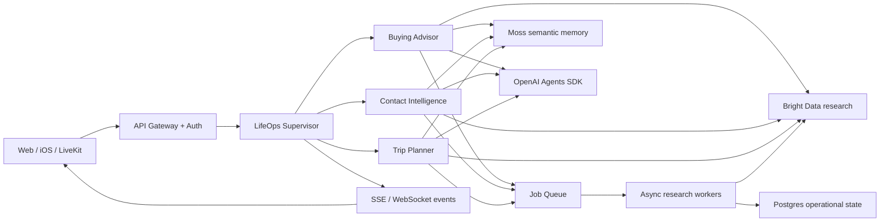

# LifeOps AI: three-agent infrastructure

## The runtime

One supervisor owns conversation continuity and delegates to a single primary specialist.
Specialists share identity, session, memory, research, policy, observability, and approval
services. This avoids three disconnected chatbots and gives the user one persistent agent.



## Infrastructure components

| Layer | Development scaffold | Production responsibility |
|---|---|---|
| Clients | Next.js and Expo iOS | Voice/text input, journey state, evidence, approvals |
| Edge/API | FastAPI | OAuth/OIDC, rate limits, request validation, idempotency |
| Agent runtime | `LifeOpsAgent` + specialists | Agents SDK traces, handoffs, tool execution |
| Sessions | In-memory repository | Redis for active conversation and streaming state |
| Operational data | Pydantic objects | Postgres for users, jobs, approvals, audits, source snapshots |
| Semantic memory | In-memory Moss interface | Moss indexes with tenant/user filters and retention |
| Research | Mock Bright Data | Bright Data search/extract/crawl workers and source timestamps |
| Async work | Inline async calls | SQS/Cloud Tasks/Temporal for long research and retries |
| Realtime voice | LiveKit bridge | Rooms, STT/TTS, interruption handling, ephemeral room tokens |
| Observability | Structured responses | OpenTelemetry, Agents traces, logs, cost/latency metrics |
| Secrets | `.env` contract | Cloud secret manager and workload identity |

## 1. Buying recommendation flow

1. User says what they want to buy.
2. Supervisor routes to Buying Advisor and retrieves budget, style, brand, size, and prior
   rejection reasons from Moss.
3. Planner creates requirement, research, shortlist, comparison, and decision tasks.
4. Research workers use Bright Data to discover products and extract current product pages.
5. A normalizer produces comparable price, shipping, warranty, return, rating, and evidence
   fields. Stale or unsupported claims are flagged.
6. Hard constraints filter candidates. A deterministic scoring tool ranks the remainder;
   the model explains—not invents—the ranking.
7. The user receives three recommendations, tradeoffs, confidence, sources, and retrieved
   times. Rejection reasons update memory and rerank the list.
8. A purchase is a separate approval-gated tool and is not implemented in this scaffold.

## 2. Contact intelligence flow

1. User supplies or records a meeting/call transcript. Voice transcription is session data
   until the user chooses to retain it.
2. Contact Intelligence extracts name, company, role, contact details, topics, commitments,
   follow-ups, and explicit preferences into a typed record.
3. Identity resolution searches the user's existing contacts first to prevent duplicates.
4. Public-profile enrichment runs only when the user explicitly consents and provides an
   authorized public URL. The service does not log in as the user, bypass controls, or scrape
   private LinkedIn data. A production implementation should prefer licensed/official data
   access and comply with site terms and applicable law.
5. Every field stores provenance and confidence. Conflicts remain visible rather than being
   silently overwritten.
6. Moss keeps relationship-relevant summaries; Postgres keeps encrypted canonical contacts,
   consent, retention, and audit records. Sensitive-trait inference is prohibited.
7. Follow-up drafting is allowed; sending a message requires a separate explicit approval.

## 3. Trip planner flow

1. Supervisor retrieves travel preferences and routes to Trip Planner.
2. Planner asks only for blocking facts: origin, dates/flexibility, travelers, budget, and
   must-do constraints.
3. Parallel research workers gather entry requirements, routes, stays, local transport,
   seasonality, and activities. Every volatile result receives an expiry/recheck time.
4. Constraint solver checks opening hours, transfer time, geography, budget, and recovery
   margin. The specialist produces itinerary alternatives instead of a prose-only answer.
5. User changes update only affected tasks and preserve accepted decisions.
6. Before booking, prices and availability are refreshed. Each booking is separately
   confirmed, idempotent, and audited.

## Data boundaries

```text
Redis/session: transcript buffer, current turn, temporary variables, stream state
Postgres: identity, canonical entities, jobs, consent, approvals, audit log
Moss: preferences, constraints, decisions, journey summaries, contact relationship context
Object storage: encrypted transcript/source artifacts with lifecycle deletion
```

Do not use semantic memory as the canonical store for consent, payments, bookings, or audit
events. Do not save raw transcripts by default. All stored records require `user_id`, source,
created time, retention class, and deletion support.

## Deployment path

Start with one FastAPI service plus one worker deployment, managed Postgres, Redis, Moss,
Bright Data, and LiveKit. Split specialist services only when independent scaling or security
boundaries justify the operational cost. Use private networking for data stores, outbound
allowlists for research workers, encrypted storage, per-user authorization filters, and
approval tokens for side effects.
