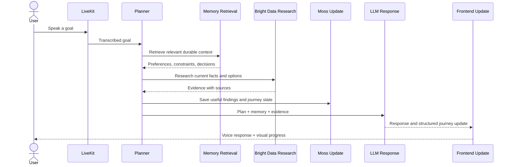

# MyMinion

MyMinion is a voice-first personal operations agent. A user states an outcome; the system turns it into a durable journey, retrieves useful context, researches changing facts, and advances the next action across web and iOS sessions. It is intentionally modeled as an agent—not a chat transcript with extra UI.

The scaffold runs end to end with deterministic in-memory Moss and Bright Data adapters. No API keys are required for local development, and provider code is kept behind typed interfaces so production adapters can replace mocks without changing business logic.

The primary product flows are Buying Advisor, Contact Intelligence, and Trip Planner. See
[`INFRASTRUCTURE.md`](INFRASTRUCTURE.md) for the complete agent loops, production topology,
data boundaries, and deployment path.

Every specialist follows the same contract:

```text
route → retrieve Moss context → create journey → Bright Data research
      → specialist evaluation → persist evidence/recommendations to Moss → next action
```

Contact enrichment never bypasses login or access controls. It uses Bright Data to discover
public professional context and extracts a supplied public profile URL only after explicit
consent. Prefer licensed or official provider access for production LinkedIn data.

## Architecture

```text
Next.js web ─┐
             ├── FastAPI delivery layer ── LifeOpsAgent use case
Expo iOS  ───┤                              ├── Planner
             │                              ├── MemoryManager ── Moss repositories
LiveKit voice┘                              ├── ResearchManager ── Bright Data service
                                            └── Session repository
```

- `frontend/` — Next.js 15, React 19, Tailwind, and shadcn-style Radix primitives. The desktop dashboard has Conversation, Journey Board, Research, and Memory Timeline surfaces.
- `mobile/` — Expo/React Native iOS client using the same API and shared contracts. It includes goal entry, a microphone interaction seam, journey progress, and evidence cards.
- `agent-py/` — FastAPI delivery, application orchestration, domain models, provider abstractions, sample journeys, and independent agent tools.
- `shared/` — portable JSON schema, TypeScript API contracts, and orchestration prompts.

Session state and long-term memory are deliberately separate. `SessionState` holds the current task, conversation, and temporary variables. Moss holds selected durable facts and journey continuity.

## Request sequence



## Provider integration points

### Moss

`MossClient` exposes logical repositories for `user_profile`, `preferences`, `journeys`,
`research`, `decisions`, `contacts`, `interactions`, and `recommendations`. Every repository
implements async `save`, `search`, `update`, and `delete`. `InMemoryMossIndex` is the offline
adapter; `MossCloudIndex` uses the official Python SDK and loads the cloud index locally for
fast semantic queries.

The live deployment stores the eight logical record types in one physical
`myminion-memory` index using `_moss_index` metadata. This works with entry-level Moss index
limits while preserving typed repository boundaries. Configure it with:

```env
USE_MOCK_MOSS=false
MOSS_PROJECT_ID=your_project_id
MOSS_PROJECT_KEY=your_project_key
MOSS_AUTO_CREATE_INDEXES=true
```

The application never commits credentials. The bootstrap is idempotent and does not modify
indexes outside the `myminion-` namespace.

`MemoryManager` does not save every message. It only accepts preferences, constraints, decisions, rejection reasons, ongoing journeys, and stable profile information that pass a confidence policy.

### Bright Data

`BrightDataService` defines async `search`, `extract`, and `crawl`. `MockBrightDataService` returns clearly marked deterministic evidence and never performs an API call. Implement the same interface with the Bright Data SDK/API, then swap the dependency provider.

`LiveBrightDataService` supports two production configurations. A Browser API WebSocket can
perform both rendered search and extraction. Alternatively, separate SERP and Web Unlocker
zones can use the Direct API.

```env
USE_MOCK_SERVICES=false
BRIGHT_DATA_API_KEY=your_generated_api_key
BRIGHT_DATA_BROWSER_WS=wss://your-browser-api-connection

# Optional Direct API alternative:
BRIGHT_DATA_SERP_ZONE=your_serp_zone
BRIGHT_DATA_UNLOCKER_ZONE=your_unlocker_zone
```

The API key comes from Bright Data account settings. Zone names come from each product's
Overview page. Never commit these values. `GET /health` reports whether live Bright Data
configuration is complete without exposing credentials.

### LiveKit

`LiveKitVoiceBridge` turns a final transcript into the exact same `LifeOpsAgent.respond()` use case used by HTTP. `livekit_entrypoint()` is the seam for room connection, STT, TTS, interruptions, and streaming. Install the `livekit` Python extra and provide credentials only when adding the real worker.

### OpenAI Agents SDK

`LifeOpsAgent` owns the deterministic orchestration order: retrieve memory, plan, research, selectively store, update session state, respond. `OpenAIAgentsAdapter` is an optional lazy-loaded SDK boundary using `Agent` and async `Runner.run`. Mock mode does not import the SDK or require credentials. In production, wrap independent functions in `tools/` as SDK function tools and inject them into the adapter.

## Run locally

Requirements: Python 3.11+, Node.js 20+, npm, Xcode with an iOS Simulator for the native client.

```bash
cp .env.example .env
python3 -m venv .venv
.venv/bin/pip install -e './agent-py[dev]'
npm install
```

Start the API:

```bash
.venv/bin/uvicorn lifeops.api.app:app --app-dir agent-py/src --reload
```

Then start either client:

```bash
npm run dev       # web: http://localhost:3000
npm run dev:ios   # Expo + iOS Simulator
```

For a physical iPhone, set `EXPO_PUBLIC_AGENT_API_URL` to the computer's LAN address (for example `http://192.168.1.20:8000`); `localhost` inside the device points to the phone. The iOS microphone purpose string is already configured. A real LiveKit room token endpoint is still required before voice streaming is enabled.

Run all checks:

```bash
make verify
```

Docker runs the web/API pair with `docker compose up --build`. Expo remains a host-native workflow because it needs the simulator or a device.

## API

- `GET /health` — liveness and adapter mode.
- `POST /v1/agent/respond` — accepts `{ user_id, session_id, message }` and returns the response, structured journey, evidence, memories used, and memories saved.
- FastAPI docs are available at `http://localhost:8000/docs`.

## Replacing mocks safely

1. Implement the existing provider interface; keep SDK types inside the adapter.
2. Add provider settings to environment configuration—never source files.
3. Replace only the dependency factory in `dependencies.py`.
4. Add contract tests using recorded/sandbox responses.
5. Keep mock mode for local development, CI, and offline demos.

External actions such as purchases, bookings, applications, or policy changes should require explicit user confirmation, be idempotent where possible, and write an audit event. Research confidence is not permission to act.
